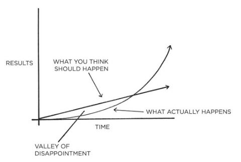

### Fundamental of habit
* Just **1% better everyday** will make a big progress, the power of habit. 
* There's _tipping point_ in the benefit of habits. Habits result works in **exponential**, it will be hard and slow at first but as you move on things will move fast.
* In reality, the _results_ of our efforts are often _delayed_. It is not until months or years later that we realize the true value of the previous work we have done. This can result in a **valley of disappointment**  

* **Focus on system** instead of goals. Goals are short and momentary, system will do better in the long run
> **True behavior change is identity change**. You might start a habit because of motivation, but _the only reason you’ll stick with one is that it becomes part of your identity_

### Process of building habits
All of these are _circular_ process, each affects the next and the last one affects the first again.
The question is now **HOW TO**
1. Cue: Make it **obvious**  
    * And to break bad habit: Make it _invisible_  
    * _Cues of a habit can be so obvious that it seem invisible_. It will go under unconscious process which will make your reactions faster. Because of this, you **will do bad habits without realizing them**. Some ways to bring them to conscious:
        * **List and mark** all of the habits with _+ for positive, - for negative and = for neutral_  
        * Pointing-and-Calling: _say out loud_ what you are thinking and about to do
    * The two most common cues are _time_ and _location_.
    * **Implementation intention**, which is a plan you make beforehand about when and where to act
        > “When situation X arises, I will perform response Y.”  
        > Fill out this sentence: **I will [BEHAVIOR] at [TIME] in [LOCATION]**. So that your intention is clear and you have no excuse for not doing it.  

    * **Habits stacking**, doing many habits consecutively, one triggers another
        > Formula: **After [CURRENT HABIT], I will [NEW HABIT]**. Be _specific_ and _clear_  

    * **Environment** is more likely to affect you more than motivation
        * _Design the environment_ like putting things in obvious place.
        * Habits associate with context, the surrounding. So **One space, one use**
        * _Self-control_ is only a _short-term_ strategy, **optimizing environment** is a better spend of energy.
        * _Cue-induced wanting_ phenomenon: an external trigger causes a compulsive craving to repeat a bad habit. Once you **notice** something, you **begin to want it.**
            > So to _break bad habit_, make it _invisible_. For example, leave the phone in another room, make food harder to reach, block porn website.

2. Craving: Make it **attractive**  
    And to break bad habit: Make it _unattractive_
    * The more attractive a activity is, the more likely it will become a habit
    * Premack’s Principle: **More probable behaviors will reinforce less probable behaviors.**
        > The habit stacking + temptation bundling formula is:
        **1. After [CURRENT HABIT], I will [HABIT I NEED].
        2. After [HABIT I NEED], I will [HABIT I WANT].**

    * Habits imitate (copy):
        1. Imitate **the close**: We pick up habits from our close one. So if you want to build a habit, _get around with those who think your action is normal_.
        2. Imitate **the many**: Going against the groups is not very attractive so make _your habits fit your_ group (does not mean you have to give up good habits to fit in)
        3. Imitate **the powerful**: Because we want to be respect and powerful. We copy what successful people have done so we can be like them.
    * The specific cravings you feel and habits you perform are really an **attempt to address your fundamental underlying motives**.
    * **Make a ritual** to build habit. For me, it could be putting my headphone to help me focus on reading.
3. Response: Make it **easy**  
    And to break bad habit: Make it _difficult_
    * Idea between **motion and action**: _Motion is when planing and strategizing. Action is the type of behavior that will deliver an outcome._
    * Motion is useful but **action is the key to get something done**. Motion make us feel like we're making progress
    * **Learning curve is logarithmic**, it will be hard as first but it will get easier as time goes on
    * **Two-minute rule**: "When you start a new habit, it should take less than two minutes to do.". The idea is to _make your habits as easy as possible to start_
        > “Read before bed each night” becomes “Read one page.”  
        > “Do thirty minutes of yoga” becomes “Take out my yoga mat.”  
        > “Run three miles” becomes “Tie my running shoes.”  

    * Using **Commitment device**: a choice you make in the present that controls your actions in the future. Such as banning all porn website, cut off the Internet when it's night time.
4. Reward: Make it **satisfying**  
    And to break bad habit: Make it _unsatisfying_  
    * **We tend to value immediate reward** more than delayed reward.
    * You would want the ending of your habit to be satisfying. The **short-term reward should be aligned with long-term vision**
    * Use a **habit tracker**. Track them down after finishing one. And **keep habit on streak**
    * **Goodhart’s Law**: When a measure becomes a target, it ceases to be a good measure. So be careful when making measurement 

### More on building habits
* **Choose the right habits for you**. Everyone is different so each will have their own types of enjoyment.
* **Using explore and exploit strategy** to find the appropriate habit.
* _Things can get boring_ after certain times of repeating. **The most important thing is keep doing it**, get pass boredom and finish your work.
